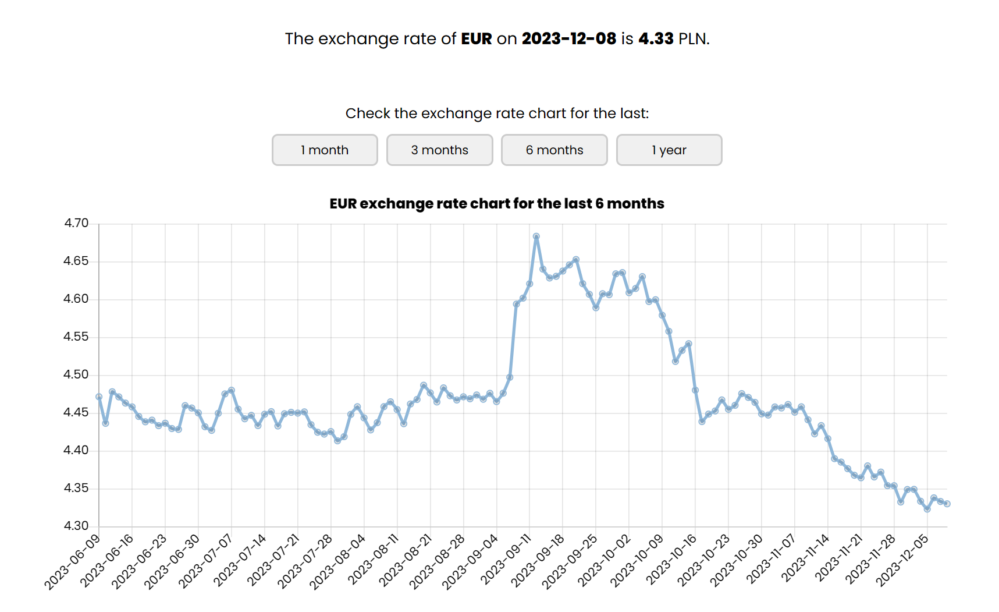

# Currency Exchange Rate Checker (JavaScript)
## Check the real-time exchange rates of the Polish zloty (PLN) against other currencies

### *Overview*:
The Currency Exchange Rate Checker is a web application that allows users to check real-time exchange rates of the Polish zloty (PLN) against various foreign currencies. Users can select a currency and a date to get the exchange rate for that day. Additionally, the application provides a historical exchange rate chart for different time ranges (1 month, 3 months, 6 months, and 1 year). The exchange rate data is sourced directly from the National Bank of Poland (NBP), ensuring accuracy and up-to-date information.


This application is an enhanced version of my previous project, [Currency Exchange Rate Checker (Python)](https://github.com/annadada/currency-exchange-rate-checker.git), which was originally built using Python and its micro web framework Flask. The logic of the current version is entirely handled by JavaScript.


### *Features*:
- Select a currency from the list of available currencies.
- Choose a date to get the exchange rate for that day.
- View the exchange rate and a result message.
- Explore historical exchange rate charts for different time ranges (1 month, 3 months, 6 months, and 1 year).
- Responsive design for various screen sizes.
- Data provided by the National Bank of Poland (NBP).

### *Technologies Used*:
This project utilizes the following technologies:
- **JavaScript:** JavaScript handles form validation, fetching exchange rate data from the NBP API, and drawing historical exchange rate charts (Chart.js).
- **HTML/CSS:** HTML is used for structuring the web page's content, while CSS is responsible for styling and layout.


### *Running the application*:
1. Clone this repository to your local machine.
   ```bash
   git clone https://github.com/annadada/currency-exchange-rate-checker-js.git
   ```
2. Navigate to the project directory.
    ```bash
    cd currency-exchange-rate-checker-js
    ```
3. Open the index.html file in a web browser to access the application.

### *Usage*:
1. Select a currency from the dropdown list.
2. Choose a date using the date picker.
3. Click the "Check the rate" button.
4. After clicking the "Check the rate" button, the application will display the exchange rate for the selected currency on the chosen date. Additionally, below the result message, you can select different time ranges (1 month, 3 months, 6 months, and 1 year) to view historical exchange rate charts.



### *Acknowledgments*:
Exchange rate data is provided by the [National Bank of Poland (NBP)](https://www.nbp.pl/).
