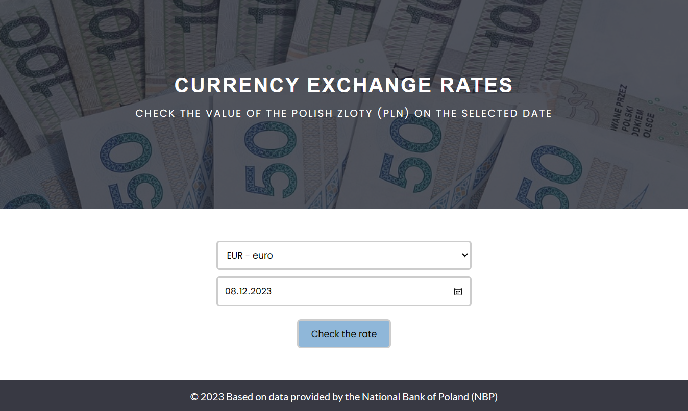

# Currency Exchange Rate Checker
## Check the real-time exchange rates of the Polish zloty (PLN) against other currencies

### *Overview*:
The Currency Exchange Rate Checker is a simple web application built with Flask and JavaScript that allows users to check real-time exchange rates of the Polish zloty (PLN) against various foreign currencies. Users can select a currency and a date to get the exchange rate for that day. Additionally, the application provides a historical exchange rate chart for the last 30 days. The exchange rate data is sourced directly from the National Bank of Poland (NBP), ensuring accuracy and up-to-date information.



### *Features*:
- Select a currency from the list of available currencies.
- Choose a date to get the exchange rate for that day.
- View the exchange rate and a result message.
- Explore the historical exchange rate chart for the last 30 days.
- Responsive design for various screen sizes.
- Data provided by the National Bank of Poland (NBP).

### *Prerequisites*:
Before you begin, ensure you have met the following requirements:
- Python 3.x installed.
- Flask, pandas, requests, and datetime Python packages installed.
- An internet connection to fetch exchange rate data from the NBP API.

### *Running the application*:
1. Clone this repository to your local machine.

   ```bash
   git clone https://github.com/your-username/currency-exchange-rate-checker.git
   ```
2. Navigate to the project directory.
    ```bash
    cd currency-exchange-rate-checker
    ```
3. Install the required Python packages.
    ```bash
    pip install flask pandas requests
    ```
4. Run the Flask application.
    ```bash
    flask run
    ```
5. Open your web browser and go to http://localhost:5000 to access the application.

### *Usage*:
1. Select a currency from the dropdown list.
2. Choose a date using the date picker.
3. Click the "Check the rate" button to view the exchange rate.
4. After clicking the "Check the rate" button, the application will display the exchange rate for the selected currency on the chosen date. Additionally, you will see a historical exchange rate chart for the last 30 days below the result message.


<!--  -->


### *Acknowledgments*:
Exchange rate data is provided by the [National Bank of Poland (NBP)](https://www.nbp.pl/).